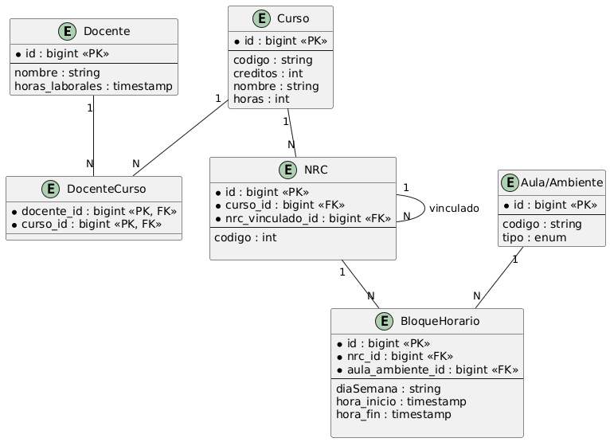

# ARQUITECTURA 
Despues de la realización de las reuniones con el ing.Casaico, la entrevista con los docentes Condori y Rosario, se definio el siguiente modelo de base de datos

Dicho modelo representa, de la manera más cercana posible, el **Proceso de Programación de Horarios Académicos**, el cual será automatizado en la segunda versión del MVP de Kairos.

## Arquitectura del Sistema

Para el desarrollo de Kairos se continuará utilizando una arquitectura por capas, basada en el patrón MVC (Model-View-Controller).

Las capas que conformarán la aplicación son:

- **Entidad** : representa las entidades del dominio y su correspondencia con las tablas de la base de datos.
- **Modelo** : contiene las estructuras y objetos utilizados para representar y transportar la información del sistema.
- **Adapter** : permite adaptar la información entre las diferentes capas y estructuras utilizadas por la aplicación.
- **Respositorio** : se encarga del acceso y persistencia de los datos en la base de datos.
- **Service** : define la lógica y operaciones principales del negocio.
- **ServiceImpl** : contiene la implementación de los servicios y la lógica de negocio.
- **Controller** : recibe las solicitudes del usuario y coordina la comunicación entre las vistas y los servicios.
- Vistas corresponden a la interfaz mediante la cual los usuarios interactúan con el sistema.
  
